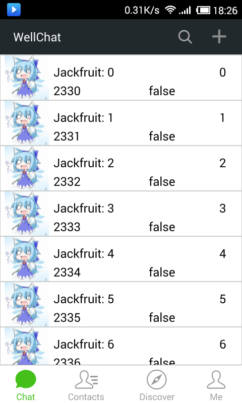
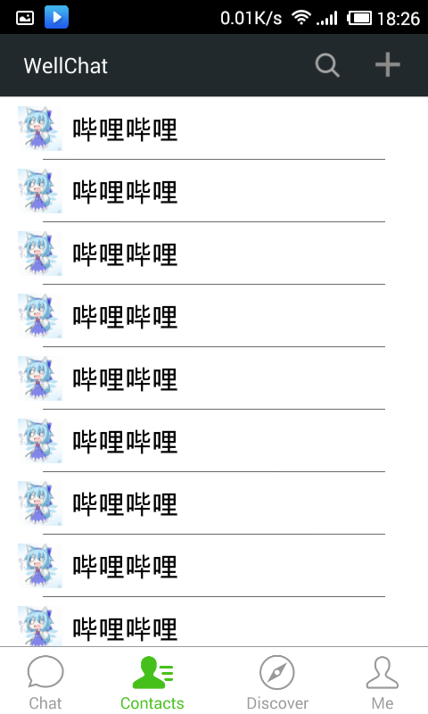
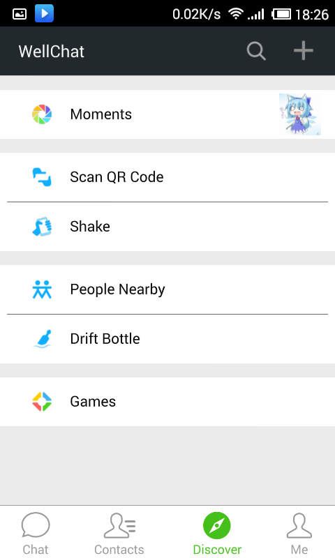
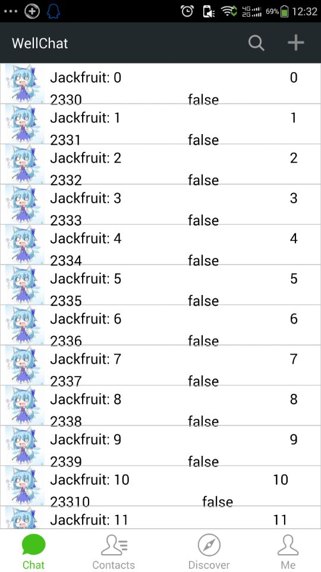
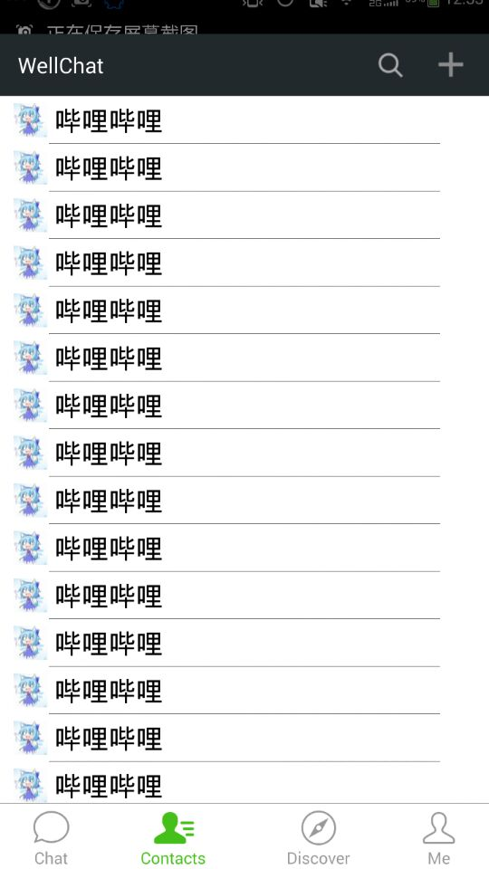
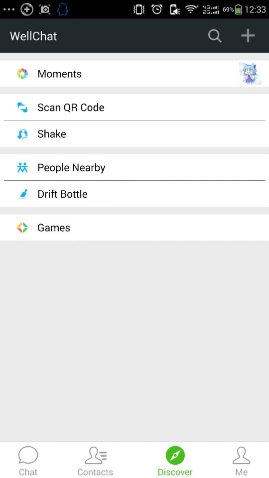
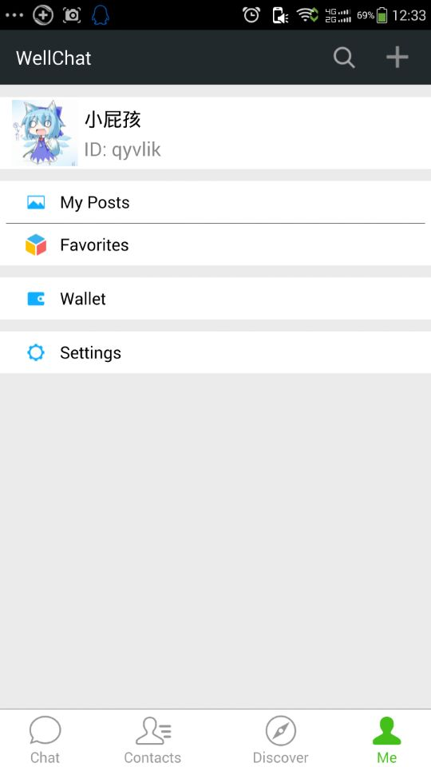

# WellChat

WellChat is a Application that is a WeChat-like APP by qml.

好吧~原谅我的英语。使用 qml 来仿制安卓微信的 Qt 程序，可以运行在安卓上。

## 界面展示

### 480 * 800

微信界面

仿制界面

### 540 * 960

微信界面

仿制界面

## QML开发安卓应用上的局限

`QtQuick.Control` 这个模块是专门为桌面平台准备的，对移动平台支持并不完善。不能很好地动态切换不同的 `ToolBar` 和 `StatusBar` 来适配不同的页面。

如何设计一个简单的页面栈呢？查看[简单易用的页面栈框架](doc/readme.md)

## 剖析界面

微信界面的主要操作交互逻辑有首界面的四个可以切换的分页，以及一个页面栈。查看[微信界面剖析](doc/weixin-ui-analyse.md)

---

***images and protocol Copyright (C) by [Tencent] (http://weixin.qq.com/)*** 

***图片、协议版权归[腾讯] (http://weixin.qq.com/) 所有！***