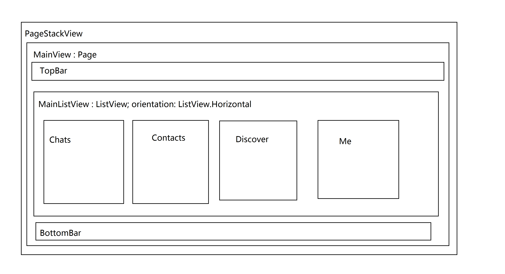

# 微信界面剖析

微信界面剖析分为：首界面，单个界面，字体大小，素材等。

## 首界面

可以先查看[简单易用的页面栈框架](readme.md)。

先看看微信的首界面。有四个分页，`BottomBar` 可以显示当前页面的以及进行切换。`TopBar` 显示微信的应用名称和两个按钮。所以首页面的实现可以使用一个横向的 `ListView` 来实现，内部有四个不同的页面，使用 `VisualItemModel` 进行加载。

现在取其中的聊天界面为例子。

在点开一个联系人进行聊天时，会将一个聊天页面压入页面栈。

先不管聊天界面是如何实现的。就讲讲页面压栈要注意的问题。

先回到首界面的 `Chats`。里面有若干个联系人，在点击某一个联系人之后，触发一个函数，将聊天页面压入栈。一般是由 `MouseArea` 触发 `clicked` 信号，然后触发页面入栈的函数。

问题来了，由于页面入栈的实现问题，`StackView` 将一个页面推入栈顶是需要时间的，所以 `StackView` 会产生一个过渡，来提高用户体验，如果你的手速够快的话，双击某个联系人，会不会触发两次点击事件呢？答案是，会的。所以在触发页面入栈的函数中应该添加一个处理语句，在当前页面 A 要将页面 B 入栈时，在处理函数中添加一句 `A.enable = false;`，在 B 页面弹出后，设置 `A.enable = true;`。就不会因为点击过快，触发两次函数，向页面栈压入两个页面了。

> ps: 后来在微信上，拼手速，以极快速度点击**设置**，确实会压入两个或两个以上的**设置**页面。不同安卓机，有不同响应，版本为 **6.2.4**。看来是通病啊。在当前页面压入另一个页面时，是需要时间的，在这个处理过程中，当前页面不做屏蔽处理的话，是十分麻烦的。当然，这种误操作只会有程序猿才能发现。

> 这个 `enable` 属性为真时，允许处理键盘和鼠标事件。详细查看 `Item::enable`。

## 单个界面

要注意微信在各个屏幕分辨率下，每个可选项的高度，这个可以直接去通过截屏了解。

**TODO**

## 字体大小

字体大小，以及安卓各个硬件上差异，进行适配就有些问题了。如何进行字体大小适配？

**TODO**

## 素材

素材获取来源互联网，所有权归腾讯公司所有。

---

字体大小，每个可选项的高度，各个不同的业务界面，例如下拉更新，下拉打开相机进行摄像，Qt 读取安卓手机上的相处并展示出来，实际的网络通信，后台业务执行，本地数据存储还未能完成，希望有高手进行补充~

